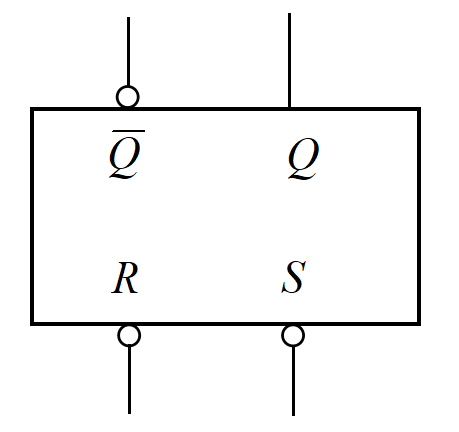
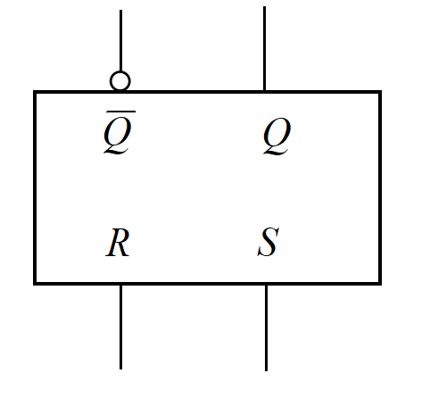
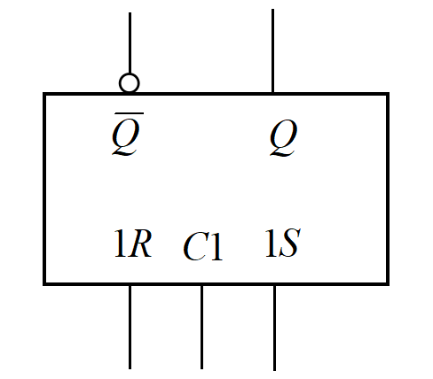
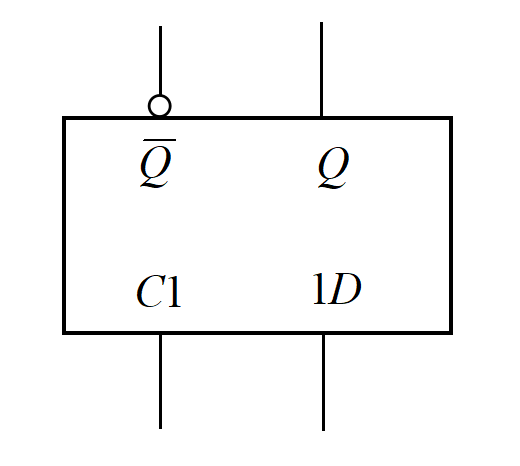
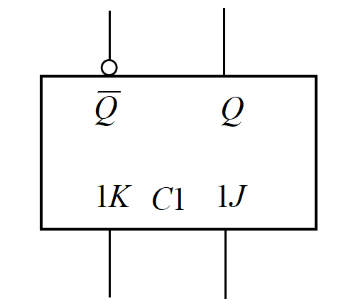
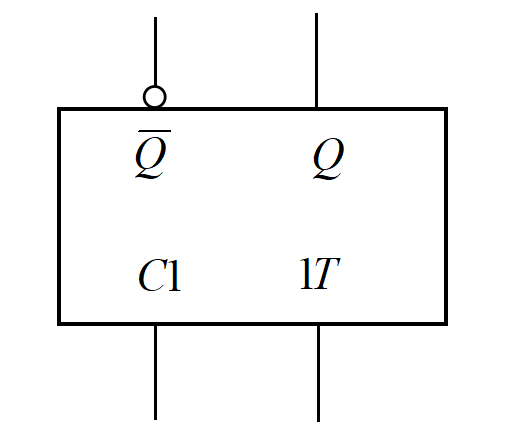
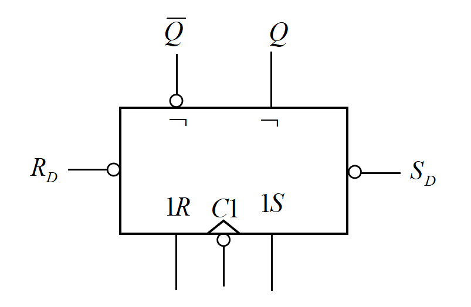
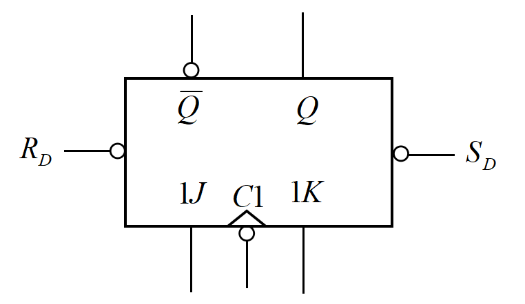
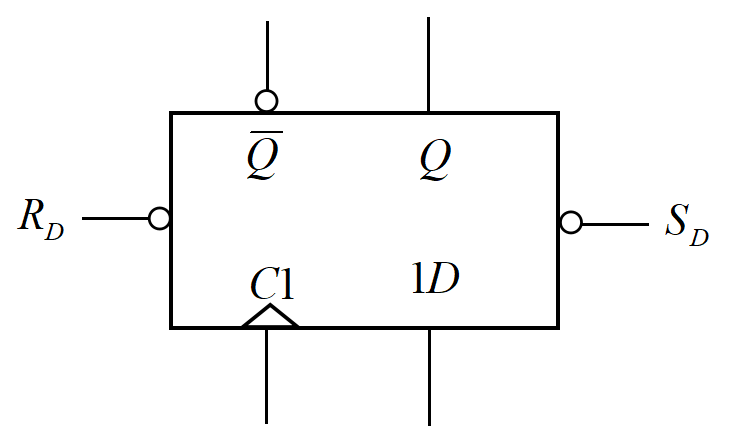
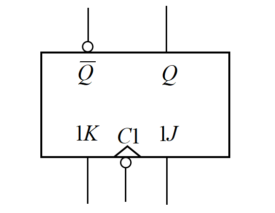

# **数字电路与逻辑设计笔记** 
<bw>wr按：\
这一部笔记，主要记录学习过程中的一些想法，以便后续查看时能回忆起当时的理解，并加深印象。</bw>

## $Chapter 1 $ &emsp;数字电路与逻辑设计基础 
&emsp;&emsp;首先来看看带符号二进制数的算术运算。我们知道，正数的三个机器码（原码、反码、补码）是一样的，只有负数才需要变换。不过，一个正数与一个负数的原码貌似是<st>不能直接进行加减运算的</st>。反码运算时，进位加到最低位（循环进位）；补码运算就直接舍弃进位了。当然，这样运算正确的前提是<st>不发生溢出</st>。
<blockquote>
    &emsp;&emsp;反码、补码加减为什么可以这样运算？这里对其正确性提供一些想法。
     &emsp;&emsp;对于两个二进制整数$a_1$和$a_2$，设其二进制补码均有$n$位，分别用$A_1$和$A_2$表示。如果把补码看作无符号二进制数，显然有:
    $$A_i=\begin{cases}
    a_i & a_i\geq 0\\
    2^n+a_i & a_i < 0
    \end{cases} \tag{1.1}$$
    &emsp;&emsp;其中$i=1,2$，$-2^{n-1}\leq a_i\leq 2^{n-1}-1$，且由式$(1.1)$也能推得$A_i$是$a_i$的补码.因此，下式是显然的：$$A_i\equiv a_i\pmod{2^n}\tag{1.2}(i=1,2)$$&emsp;&emsp;直接对$A_1$和$A_2$进行加法运算，如果产生进位则舍去（相当于减去了$2^n$），如果记这样算得的和为$S$.将$S$视为无符号二进制数，那么
    $$S\equiv A_1+A_2\pmod{2^n} \tag{1.3}$$
    $$0\leq S\leq 2^n-1\tag{1.4}$$
    &emsp;&emsp;根据同余的性质，由式$(1.2)(1.3)$可得：
    $$S\equiv a_1+a_2\pmod{2^n} \tag{1.5}$$
    &emsp;&emsp;而在不发生溢出的前提下，$a_1+a_2$应仍然可以用$n$位补码表示，即有：$$-2^{n-1}\leq a_1+a_2\leq 2^{n-1}-1 \tag{1.6}$$
    &emsp;&emsp;综合式$(1.4)$~$(1.6)$发现，当$-2^{n-1}\leq a_1+a_2 < 0$时，应有$S=a_1+a_2+2^n$；而当$0\leq a_1+a_2\leq 2^{n-1}-1$时，应有$S=a_1+a_2$.即$S$与$a_1+a_2$有以下关系成立：
    $$S=\begin{cases}
    a_1+a_2+2^n & a_1+a_2 < 0\\
    a_1+a_2 & a_1+a_2\geq 0
    \end{cases} \tag{1.7}$$
    &emsp;&emsp;式$(1.7)$与式$(1.1)$在形式上完全相符，因此我们所算得的$S$就是$a_1+a_2$的结果的补码。反码计算的正确性也可以用同样的方法得证。
</blockquote>

&emsp;&emsp;然后说说格雷码（Gray Code）。感觉其重点在于二进制码与对应格雷码之间的相互转换。实际上只需要记住二进制码转化为格雷码（单向）的方式即可：
$$G_n=B_n$$ 
$$G_i=B_{i+1}\oplus B_i(i<n)$$
&emsp;&emsp;某一位的格雷码，等于对位的二进制码与高位的二进制码的异或。格雷码转换为二进制码的公式可以依据异或的性质由上式反推。
<blockquote>
    关于异或的一些小性质： 
    （1）$ A\oplus B=C\rightarrow $ $ B\oplus C=A $ 且 $ A\oplus C=B $. 
    （2）对应连续异或的式子如：$$A=A_1\oplus A_2\oplus …\oplus A_n$$
    &emsp;&emsp;$A$可以看作是$A_i(i=1,2,…,n)$的算数和（也就是不再看作布尔变量求和）模2.
</blockquote>

## $Chapter 2 $ &emsp;逻辑代数基础 
&emsp;&emsp;逻辑代数运算和集合运算有很多相通之处：

<table align="center">
  <caption align="top">表 逻辑运算与集合运算对比</caption>
  <tr>
    <th >逻辑运算</th>
    <td >$+$（或）</td>
    <td >$\cdot$（与）</td>
    <td >$\overline{A}$（非）</td>
    <td >$\oplus$（异或）</td>
    <td >$1$</td>
    <td >$0$</td>
  </tr>
  <tr>
    <th >集合运算</th>
    <td >$\cup$（并）</td>
    <td >$\cap$（交）</td>
    <td >~$A$ （绝对补集）</td>
    <td >$\oplus$ （对称差集）</td>
    <td >$U$ （全集）</td>
    <td >$\varnothing$</td>
  </tr>
</table>

&emsp;&emsp;其中异或运算和对称差集运算甚至使用了相同的符号。实际上，完全可以把逻辑变量看成是一些<st>最小项的集合</st>，逻辑运算则就是对这些最小项的集合进行运算。这样的类比，能够方便理解一些逻辑公式。

## $Chapter3$ &emsp;半导体与集成门电路
&emsp;&emsp;~~这是什么？讲过吗？~~ 这里可以主要看看三态门，其他的内容考察貌似不太涉及。

## $Chapter4$ &emsp;组合逻辑电路
&emsp;&emsp;组合逻辑电路好啊！至少相比于时序逻辑电路，没有那么多逆天触发器。~~相对而言比较适合我这个飞舞~~\
&emsp;&emsp;先对这一章中出现的一些逻辑部件进行大致 ~~（雾）~~ 的梳理：\
**一、全加器和半加器**\
&emsp;&emsp;实现1位二进制数的加法。半加器，2输入2输出，通过输入加数$A_i$和$B_i$，产生和$C_i$以及进位$S_i$.全加器则是在半加器的基础上考虑来自低位的进位，所以是3输入2输出。\
**二、并行加法器**\
&emsp;&emsp;实现多位二进制数的加法，依据进位方式分为串行进位和超前进位。常见的有4位并行加法器74283，9输入（2个4位二进制数、低位进位）5输出（4位二进制和、高位进位）。\
**三、编码器**\
&emsp;&emsp;第$k$道输入信号$\rightarrow$二进制数$k$.二进制编码器为典型，$2^n$输入$n$输出（$n=2,3,4$）。二—十进制编码器（10输入4输出）加使用输出标志$S$（判定输出是否有效），且<st>输入低电平有效</st>。优先编码器比较复杂不予评价，根据其名脑补即可。\
**四、译码器**\
&emsp;&emsp;二进制数$k\rightarrow$第$k$道输出信号。二进制译码器为典型，$n$输入$2^n$输出（$n=2,3,4$），<st>输出低电平有效</st>，还赠送使能端。二—十进制译码器<st>输出低电平有效</st>。\
**五、多路选择器(MUX)和多路分配器(DEMUX)**\
&emsp;&emsp;MUX从多个输入中选其一输出。常见的是4路选择器74153，使能端$G$高电平状态下一票否决。DEMUX将输入选择一端输出。\
**六、数值比较器**\
&emsp;&emsp;比较两个无符号二进制数大小。常见的4位数值比较器7485，如果能比出两个数的大小就输出，否则看低片$I_{A > B}$、$I_{A < B}$、$I_{A=B}$的结果输出。\
\
&emsp;&emsp;险象的判断中，有用卡诺图判断险象的方法。但是该方法使用的局限性很大，安全使用需要<st>保证逻辑表达式为与或表达式</st>。同时，卡诺图只能判定“0”型险象，无法判定“1”型险象的存在。
<blockquote>
    &emsp;&emsp;关于卡诺图判定的险象的一些思考。为什么卡诺图中“相切”与险象挂钩？下面一一个4元逻辑函数$F=f(A,B,C,D)$为例，试图证明一个与或表达式可能存在险象的充分条件是其卡诺图中存在相切的卡诺圈，且不存在被同一卡诺圈包含的相邻最小项。 
    &emsp;&emsp;不妨设卡诺圈的切线方向为竖直方向，这样切线$\tau$将整个卡诺图分为左、右两部分。记$\tau$左边、右边的卡诺圈分别为$C_1,C_2$.如果将$\tau$左边第2列、左边第1列、右边第1列、右边第2列分别用4个卡诺圈$B_1,B_2,B_3,B_4$圈起来，那么这4个圈可以分别用4个不同的2元与式表示。事实上，如果记圈$B_i(i=1,2,3,4)$表示的与式为$b_i$，则
    $$\{b_1,b_2,b_3,b_4\}=\{AB,A\overline{B},\overline{A}B,\overline{A}\overline{B}\}$$
    &emsp;&emsp;根据卡诺图的构造，$b_2,b_3$将含且仅含一对反相的变量，分别记为$M$和$\overline{M}$，其中$M\in\{A,\overline{A},B,\overline{B}\}$。因为相切关系的存在，$C_1$只可能含有$B_2$列或含有$B_2,B_3$列，而在这两种情况下，圈$C_1$表征的与式中必定含有$M$，同理圈$C_2$表征的与式必定含有$\overline{M}$，而不存在被同一卡诺圈包含的相邻最小项则保证了不存在与项赋值后为1（这里偷懒了），所以与或表达式可能存在险象。 
    &emsp;&emsp;必要性感觉也是成立的，但是不会证，而且貌似用不上。 
    &emsp;&emsp;我们从上面也能看到，每一个卡诺圈对应一些与项，而多个卡诺圈之间的关系因应为逻辑或，所以卡诺图是与或表达式的一种等价阐述。正是因为如此，卡诺图并不适用于判断非与或表达式类型的险象。并且，与或表达式在赋值后无法产生诸如$A\cdot\overline{A}$的表达式，所以无法判定“1”型险象的存在。
</blockquote>

## $Chapter5$ &emsp;触发器
&emsp;&emsp;毫无疑问的一点是，这一章是时序逻辑电路的重要基础。本章描述了很多类型的触发器，不过正如目录中所陈列的那样，它们可以分为四类。\
**一、基本RS触发器**\
&emsp;&emsp;又分为两种，由与非门构成的（逻辑符号图如左图），以及由或非门构成的（逻辑符号图如右图）。其中，*R*代表RESET（重设），有效时会将输出*Q*置为0；*S*代表SET（设置），有效时会将输出*Q*置为1.

</img></img>

&emsp;&emsp;这样就可以理解基本RS触发器的4种情况。对于左边的，由与非门构成的RS触发器，由于其低电平有效：\
&emsp;&emsp;*RS* = 00&emsp;$\rightarrow$&emsp;RESET且SET，显然这是不被允许的。\
&emsp;&emsp;*RS* = 01&emsp;$\rightarrow$&emsp;仅RESET&emsp;$\rightarrow$&emsp;*Q*置0.\
&emsp;&emsp;*RS* = 10&emsp;$\rightarrow$&emsp;仅SET&emsp;$\rightarrow$&emsp;*Q*置1.\
&emsp;&emsp;*RS* = 11&emsp;$\rightarrow$&emsp;***No operation***&emsp;$\rightarrow$&emsp;*Q*不变.\
&emsp;&emsp;同样可以理解另一种RS触发器的工作方式。\
**二、同步触发器**\
&emsp;&emsp;时钟*CP*从这里开始引入。从此以后的触发器，全都带有这个时钟控制变量*CP*，这是让人很头疼的事情。我们需要知道<st>触发器的工作窗口与时钟信号的关系</st>，这是一个比较关键的点。下面的4种触发器的“同步”功能均是通过时钟信号控制的，因此又叫钟控触发器，并且这些触发器的工作窗口都是<st>时钟高电平</st>。\
**1.钟控RS触发器**

</img>

&emsp;&emsp;这是它的逻辑符号图。构造上，可以有这个：
与非门基本RS触发器 $+$ 2个与非门 $=$ 钟控RS触发器

&emsp;&emsp;当*CP* =  0，触发器被锁死了，状态不变。当*CP* = 1，触发器被打开，这时它的工作结果和或非门构成的基本RS触发器是一样的。这个时钟信号*CP*和组合逻辑电路器件中的“使能端”有些类似。\
&emsp;&emsp;有时候在触发器两端加上$R_D$和$S_D$，可以强制改变触发器的状态。\
**2.钟控D触发器**

</img>

&emsp;&emsp;这是它的逻辑符号图。\
&emsp;&emsp;在钟控RS触发器的基础上，令$S=D,R=\overline{D}$即可得到钟控D触发器。同样当*CP* = 0时触发器锁死，*CP* = 1时，输出*Q*就是*D*（所以可以把*D*解释为Data）.\
&emsp;&emsp;这个触发器没有非法输入。\
**3.钟控JK触发器**

</img>

&emsp;&emsp;这是它的逻辑符号图。\
&emsp;&emsp;相比于前面的2个同步触发器，钟控JK触发器有一点很特别。<st>输出端到控制门有反馈线。</st>这就导致它的功能中出现了前所未有的“改变”（前面的触发器，功能仅限于“置0”“置1”“不变”）。\
&emsp;&emsp;当*CP* = 0时，触发器锁死；*CP* = 1时，钟控JK触发器的功能可以用口诀概述为“00不变11改，JK不同随J摆”。\
&emsp;&emsp;再来谈谈这个“改变”，它比较玄乎——因为这个时候不看触发器的现态，还真不知道次态是什么；但是置0、置1就不同，不需要关心你的现态。所以钟控JK触发器存在<st>第二类空翻</st>现象：在时钟为有效电平的时间段内，输出不发生改变，但输入诱导的结果是“改变输出”，于是输出在这段时间内不断地被改变，表现为反复横跳。也就是说钟控JK触发器在“改变”功能（也就是*J* = *K* = 1）持续时段，输出*Q*会不断在0和1之间横跳，直到“改变”功能结束。\
&emsp;&emsp;其实对于“不变”功能而言，要想知道次态，我们也必须知道现态是什么。我们也可以这样理解：在“不变”功能持续阶段，输出*Q*一直在进行“不变”操作，只是电平不发生变化，所以没有观察到第二类翻转。\
**4.钟控T触发器**

</img>

&emsp;&emsp;这是它的逻辑符号图。\
&emsp;&emsp;在钟控JK触发器的基础上，令$J=K=T$即可得到钟控T触发器。它相当于只有“00不变”和“11改”的低配钟控JK触发器，显然它也存在<st>第二类空翻</st>现象。\
\
&emsp;&emsp;然后，这些同步触发器其实还存在<st>第一类空翻</st>现象：在时钟为有效电平的时间段内，输入本身发生“跳动”（就是输入电平信号本身不稳定），直接导致输出也跟着横跳。这一类空翻的发生是因为同步触发器的工作窗口都是<st>时钟高电平</st>（这是一段时间，而不是某个时刻），触发器的输入在这段时间内都会影响输出。\
**三、主从触发器**\
&emsp;&emsp;主从触发器主要解决了一些同步触发器空翻的问题，此类触发器的输出不再和某一段时间相关，而是仅与某些时刻相关。但是主从触发器其实都<st>含有2个触发器</st>，需要2个时钟信号接入，这一点与前面的触发器都不同。由于这两个触发器的时钟信号未必都是*CP*，所以2个触发器就可能有不同的工作窗口。\
**1.主从RS触发器**

</img>

&emsp;&emsp;这是它的逻辑符号图。\
&emsp;&emsp;它是由两个钟控RS触发器构成的，一个作主触发器，一个作从触发器。在*CP* = 1时，主触发器的输出其实仍然会存在<st>第一类空翻</st>现象，但是此时从触发器被锁死了。整个触发器的输出（从触发器的输出）仅取决于时钟*CP*下降沿的输入。\
&emsp;&emsp;对于主从RS触发器，主触发器的工作窗口是<st>时钟高电平</st>，从触发器的工作窗口是<st>时钟下降沿</st>。\
**2.主从JK触发器**

</img>

&emsp;&emsp;这是它的逻辑符号图。\
&emsp;&emsp;主从JK触发器，也是存在这样的特别结构：<st>从触发器输出端到主触发器控制门有反馈线</st>。与由于$J,K$直接相连的逻辑门分别受到$Q,\overline{Q}$的控制，因此只要主从JK触发器正常工作，这两个逻辑门在同一时刻必是一个打开、另一个封锁的状态。也正是因为有着这样的特点，主从JK触发器才会存在“一次翻转”的现象。
<blockquote>
    &emsp;&emsp;对于“一次翻转”的现象，这里简单阐述一下我的解释。我们从$CP=1$时（主触发器打开，从触发器封锁）开始看起，并假设触发器现在的状态是$Q=0,\overline{Q}=1$. &emsp;&emsp;此时我们会发现，主触发器中和$K$相连的与非门被封锁，$K$的输入将无法改变主触发器的状态。然而即便如此，当已知$Q=0$时，通过穷举输入$JK$的4种情况，我们会发现“00不变11改，JK不同随J摆”这一规律仍然成立——这样就解释了“一次翻转”中的“能够翻转”。 &emsp;&emsp;而当“翻转”已经发生（这当且仅当$J=1$）时，主触发器的状态改变（$Q_主：0\rightarrow 1$），与$J$间接相连的与非门（也就是输出$Q_主$的与非门）将被$\overline{Q}_主=0$锁定。此后$J$也被锁定，其输出将无法改变主触发器的状态，因此最多翻转一次。 &emsp;&emsp;对于$Q=1,\overline{Q}=0$的情况，也可以类似地进行说明。
</blockquote>

&emsp;&emsp;对于主从JK触发器，主触发器的工作窗口是<st>时钟高电平</st>，从触发器的工作窗口是<st>时钟下降沿</st>。\
**四、边沿触发器**\
&emsp;&emsp;很可惜，JK触发器的“一次翻转”现象并不讨喜，因为它并不是在时钟边缘采样。主从触发器依赖主触发器的中介作用，实现了从触发器“接收时钟边沿输入”的功能；而边沿触发器则是直接接收时钟边沿输入。\
**1.维持-阻塞D触发器**

</img>

&emsp;&emsp;这是它的逻辑符号图。当*CP* = 0时，触发器（控制门）被锁住；当*CP* = 1时，触发器打开，可以接收外接信号，同时在接收到信号时锁住与*D*相连的与非门或者触发器的控制门（当输入*D* = 0时锁与*D*相连的与非门，当输入*D* = 1时锁住控制门），不再受输入*D*的影响。\
&emsp;&emsp;这个触发器的工作窗口是<st>时钟上升沿</st>。\
**2.边沿JK触发器**

</img>

&emsp;&emsp;这是它的逻辑符号图。这个触发器比较独特，它是这一章介绍的唯一一个利用门电路传输延迟时间实现的触发器。这个触发器的工作窗口是<st>时钟下降沿</st>。

## $Chapter6$ &emsp;时序逻辑电路
&emsp;&emsp;比较重量级的一章，我学得也不是很明白。个人认为这是数字电路的精髓所在。\
&emsp;&emsp;那就顺着自己的思路，尝试对这一章感觉比较重要的一些点进行梳理吧。\
**一、时序逻辑电路的描述方法**\
**1.输出函数表达式**\
&emsp;&emsp;一般用$Z$来表示电路的输出，如果有多个，那就$Z_1,Z_2,…,Z_m$.对于Mealy型电路，$Z$是输入$x$和各个触发器现态$y$的函数；对于Moore型电路$Z$是且仅是现态$y$的函数。这是Mealy型与Moore型电路的区别所在，所以我们可以从输出函数表达式或者逻辑电路图直接看出电路的类型。\
&emsp;&emsp;但是大多数时候，我们需要从时序图中看出电路类型。如果存在这样一个时刻，各现态$y$都没发生改变，但是输出$Z$变了，那么这肯定是$x$变化导致的，可以判断电路是Mealy型的。否则一般就是Moore型。\
&emsp;&emsp;有些时候电路<st>没有输出$Z$</st>，但是仍然要求我们判断电路的类型 ~~（有点逆天）~~ ，我们认为这是一种<st>特殊的Moore型电路</st>，此时<st>没有专门的输出，状态即输出</st>。\
**2.激励函数表达式**\
&emsp;&emsp;简单来说，就是要求我们用输入$x$和触发器的现态$y$来表示各个触发器的输入$Y$。BTW，这一章的触发器都是<st>边沿触发器</st>，就是触发器只根据时钟有效沿时的输入来更新输出。 ~~说实话，这很仁慈了~~\
&emsp;&emsp;触发器的输入$Y$肯定不止一个的，至少它们都有时钟端*CP*.这一章常用D触发器（输入还含有*D*）、T触发器（输入还含有*T*）和JK触发器（输入还含有*J*和*K*）。\
**3.次态函数表达式**\
&emsp;&emsp;用本触发器的现态$y_i$和激励函数$Y_i$来表示次态$y_i^{n+1}$.注意这个$Y_i$要用$x$和$y$来表示，也就是最终写成的$y_i^{n+1}=f(x,y,y_i)$的形式。\
**4.状态表和状态图**\
&emsp;&emsp;这两个图表题目中可能经常要用到。还有一个比较常用的叫做“次态真值表”，它的表头往往是这样的：
<table align="center">
    <tr>
    <th>输入</th>
    <th>现态</th>
    <th>激励函数</th>
    <th>次态</th>
    <th>输出</th>
    </tr>
</table>

&emsp;&emsp;其中我们需要枚举各种可能的“输入”与“现态”的组合，然后分别计算出相应的“激励函数”“次态”与“输出”。可以认为次态真值表是从激励函数表达式和输出函数表达式过渡到状态表（图）的媒介。\
&emsp;&emsp;对于同步时序逻辑电路，如果是Mealy型的，则直接按照上面的表头写次态真值表；如果是Moore型的，省略**输入**一栏即可。\
&emsp;&emsp;异步时序逻辑电路，输入一栏应是时钟信号*CP*（在多输入情况下，也有表示为$x_1,x_2…$的，总之就是所有的输入放在这一栏）.由于我们在设计异步时序逻辑电路的时候，一般只考虑时钟$C_i$的输入脉冲为**正脉冲**的情况，并且<st>要求触发器在脉冲后沿翻转</st>以避免意外事件的发生，因此一般采用下降沿翻转的触发器。不过有时候，也会考虑给时钟$C_i$输入**负脉冲**，这个时候就要采用上升沿翻转的触发器。

<blockquote>
<b>&emsp;&emsp;a.正脉冲与负脉冲时钟的次态真值表。</b> 
&emsp;&emsp;如果一个异步时序逻辑电路含有三个下降沿JK触发器，它们的激励函数与输出函数表达式是这样的：
$$C_1=CP\qquad J_1=\overline{y_3}\qquad K_1=1$$
$$C_2=y_1\qquad J_2=K_2=1$$
$$C_3=CP\qquad J_3=y_2y_1\qquad K_3=1$$
$$Z=y_3$$
&emsp;&emsp;那么只有当<em>CP</em>是正脉冲的时候，JK触发器的时钟端才有可能是正脉冲，从而让触发器在脉冲后沿翻转。此时<em>CP</em>在输入栏就应该填写1（代表正脉冲）. &emsp;&emsp;需要指出的是，触发器2的时钟$C_2$虽然不含<em>CP</em>，但它也是会翻转的。当触发器1接收到时钟信号，使得其输出$y_1$从1变成0时，此时$C_2$也是下降沿，触发器2随后也会翻转。 
&emsp;&emsp;次态真值表如下：

<table align="center">
    <tr>
    <th>输入 $CP$</th>
    <th>现态 $y_3y_2y_1$</th>
    <th>激励函数 $C_3J_3K_3C_2J_2K_2C_1J_1K_1$</th>
    <th>次态 $y_3^{n+1}y_2^{n+1}y_1^{n+1}$</th>
    <th>输出 $Z$</th>
    </tr>
    <tr>
    <td>$1$</td>
    <td>$……$</td>
    <td>$……$</td>
    <td>$……$</td>
    <td>$……$</td>
    </tr>
    <tr>
    <td>$1$</td>
    <td>$……$</td>
    <td>$……$</td>
    <td>$……$</td>
    <td>$……$</td>
    </tr>
    <tr>
    <td>$1$</td>
    <td>$……$</td>
    <td>$……$</td>
    <td>$……$</td>
    <td>$……$</td>
    </tr>
    <tr>
    <td>$1$</td>
    <td>$……$</td>
    <td>$……$</td>
    <td>$……$</td>
    <td>$……$</td>
    </tr>
    <tr>
    <td>$1$</td>
    <td>$……$</td>
    <td>$……$</td>
    <td>$……$</td>
    <td>$……$</td>
    </tr>
    <tr>
    <td>$1$</td>
    <td>$……$</td>
    <td>$……$</td>
    <td>$……$</td>
    <td>$……$</td>
    </tr>
    <tr>
    <td>$1$</td>
    <td>$……$</td>
    <td>$……$</td>
    <td>$……$</td>
    <td>$……$</td>
    </tr>
    <tr>
    <td>$1$</td>
    <td>$……$</td>
    <td>$……$</td>
    <td>$……$</td>
    <td>$……$</td>
    </tr>
</table>
&emsp;&emsp;如果一个异步时序逻辑电路含有三个下降沿T触发器，它们的激励函数表达式是这样的：
$$C_1=\overline{CP}\cdot\overline{y_3}\qquad T_1=1$$
$$C_2=y_1\qquad T_2=1$$
$$C_3=\overline{CP}\cdot(y_2y_1+y_3)\qquad T_3=1$$
&emsp;&emsp;那么只有当<em>CP</em>是负脉冲的时候，经过反相的$\overline{CP}$就变成正脉冲，$C_1,C_3$才有可能接收到正脉冲。此时<em>CP</em>在输入栏就应该填写0（代表负脉冲）.触发器2的翻转情况同上面的例子。 
&emsp;&emsp;次态真值表如下：

<table align="center">
    <tr>
    <th>输入 $CP$</th>
    <th>现态 $y_3y_2y_1$</th>
    <th>激励函数 $C_3T_3C_2T_2C_1T_1$</th>
    <th>次态 $y_3^{n+1}y_2^{n+1}y_1^{n+1}$</th>
    </tr>
    <tr>
    <td>$0$</td>
    <td>$……$</td>
    <td>$……$</td>
    <td>$……$</td>
    </tr>
    <tr>
    <td>$0$</td>
    <td>$……$</td>
    <td>$……$</td>
    <td>$……$</td>
    </tr>
    <tr>
    <td>$0$</td>
    <td>$……$</td>
    <td>$……$</td>
    <td>$……$</td>
    </tr>
    <tr>
    <td>$0$</td>
    <td>$……$</td>
    <td>$……$</td>
    <td>$……$</td>
    </tr>
    <tr>
    <td>$0$</td>
    <td>$……$</td>
    <td>$……$</td>
    <td>$……$</td>
    </tr>
    <tr>
    <td>$0$</td>
    <td>$……$</td>
    <td>$……$</td>
    <td>$……$</td>
    </tr>
    <tr>
    <td>$0$</td>
    <td>$……$</td>
    <td>$……$</td>
    <td>$……$</td>
    </tr>
    <tr>
    <td>$0$</td>
    <td>$……$</td>
    <td>$……$</td>
    <td>$……$</td>
    </tr>
</table>
<b>&emsp;&emsp;b.为什么一般只考虑时钟端$C_i$收到的脉冲为正脉冲？</b> 
&emsp;&emsp;结合了以下教材，给出我自己的一些理解。因为次态真值表“输入”一栏的“0”除了表示“负脉冲”以外，还可以表示“无脉冲”。无脉冲的含义出现于存在多个输入$x_1…x_n$的时候，因为异步时序电路要求一次最多有一个输入脉冲，所以每一行都是某个输入$x_i$有脉冲、其余输入$x_j(j\neq i)$无脉冲的情况。为了避免这个歧义，我们不采用0的“负脉冲”的含义，所以也就一般不考虑负脉冲的输入。对于<b>a</b>中第2个例子，我们一般的处理方法是在时钟端增加一个反相器，使得时钟端的激励表达式变为：
$$C_1=CP+y_3\qquad C_3=CP+\overline{y_2y_1+y_3}$$
&emsp;&emsp;从而转化为正脉冲的情况（由于$C_2$的表达式不含时钟，触发器2也可以不加反相器）。 
&emsp;&emsp;当然，如果实在要设计负脉冲，也可以这样：次态真值表的输入中，“0”表示无脉冲，“$\uparrow$”表示负脉冲（因为负脉冲后沿是上升沿），“$\downarrow$”表示正脉冲（因为正脉冲后沿是下降沿）。 
<b>&emsp;&emsp;c.为什么触发器要在脉冲后沿翻转？</b> 
&emsp;&emsp;聊一下我本人的看法。这也是在期末复习的时候得到的启发。对于这个问题，书本上没有过多地解释，只是含糊地概括为不在脉冲后沿翻转“会导致触发器状态出现意外的改变”，我认为还是为了<b>避免多次翻转</b>。 
&emsp;&emsp;考虑一个这样的脉冲异步时序电路，它由3个下降沿翻转的JK触发器构成，没有专门的输出，有一个输入<em>CP</em>，其次态方程为
$$C_1=CP\qquad J_1=1\qquad K_1=\overline{y_3}$$$$C_2=y_1\qquad J_2=K_2=1$$$$C_3=CP\cdot y_3+y_2\qquad J_3=K_3=1$$
&emsp;&emsp;如果假设<em>CP</em>是正脉冲，那么所有触发器都会在脉冲的后沿触发，可以按照常规方法列写次态真值表。 
&emsp;&emsp;下面我们仍然假设<em>CP</em>是正脉冲，但是把所有的触发器改成上升沿反转的触发器，也就是所有触发器在脉冲的前沿触发。考虑在$y_3=1,y_2=y_1=0$时，给予一个正脉冲<em>CP</em>.首先，触发器1和触发器3同时接收到上升沿信号，同时翻转：
$$y_1^{n+1}=1,y_3^{n+1}=0$$
&emsp;&emsp;与此同时，$C_3$也立刻变成0，即上升沿后立刻迎来下降沿。但是由于$y_1=0\rightarrow y_1^{n+1}=1$给$C_2$带来了上升沿，触发器2随即也要翻转一次，$y_2^{n+1}=1$.这样又给$C_3$带来了上升沿，触发器3<b>发生第二次翻转</b>。这是比较麻烦的，因为触发器发生两次翻转无法在次态真值表中很好地记录，在实际电路中更是会产生干扰输出。 
&emsp;&emsp;但是，在这个例子中，我们令触发器在脉冲后沿翻转，就不会有上述情况的发生。所以我们设计触发器在脉冲后沿翻转。
</blockquote>

**二、中规模时序逻辑电路**\
&emsp;&emsp;和中规模组合逻辑电路一样，中规模时序逻辑电路也是利用已经集成好的一些芯片进行电路的设计。触发器之类的时序电路已经包装在芯片里面了，大多数情况只需利用芯片和一些逻辑门（组合逻辑器件）就可以完成电路的设计。分析也是一样的道理。\
**1.集成同步计数器74193（Mealy型）**\
**a**.置数部分：$D,C,B,A,\overline{LD},CLR$.\
&emsp;&emsp;在$CLR$端输入高电平（1）时清零，$Q _D,Q _C,Q _B,Q _A=0000$.如果$CLR$输入低电平，此时在$\overline{LD}$端输入低电平（0）的时候，可以将$D,C,B,A$依次赋值给$Q _D,Q _C,Q _B,Q _A$.\
**b**.计数脉冲：$CP_U,CP_D$.\
&emsp;&emsp;分别是加法脉冲（Up）和减法脉冲（Down），不过都是<st>上升沿触发</st>。按照后沿触发的规定，这两端都应输入负脉冲。不允许这两端同时出现脉冲。\
**c**.进位（Carry）、借位（Borrow）输出：$\overline{Q} _{CC},\overline{Q} _{CB}$.\
&emsp;&emsp;称为即将进位、即将借位输出更合适。对于$\overline{Q} _ {CC}$而言，在$Q _DQ _CQ _BQ _A=1111$且$CP_U$负脉冲开始时产生进位信号$\overline{Q} _ {CC}$，在$CP _U$负脉冲结束时，内部触发器翻转，$Q _DQ _CQ _BQ _A=0000$，与此同时进位信号$\overline{Q} _{CC}$消失。对于退位信号$\overline{Q} _ {CB}$，也是一样的道理。\
**2.集成异步计数器74290**\
&emsp;&emsp;其内部构造是一个模2计数器和一个模5计数器，两者之间没有直接联系。其异步置9（$R _{9A}=R _{9B}=1$）的优先级比异步置0（$R _{0A}=R _{0B}=1$）要高，计数脉冲均为<st>下降沿触发</st>（所以计数脉冲的引脚端有小圆圈）。没有专门的输出引脚，也可以说是一种特殊的Moore型电路。\
**3.移位寄存器74194**\
&emsp;&emsp;低电平有效的清零输入$\overline{CLR}$具有最高优先级。寄存器的其它功能都工作在时钟$CP$的<st>上升沿</st>。
<table align="center">
    <caption align="top">表 寄存器74194的功能与$S_1,S_0$的关系</caption>
    <tr>
        <th>$S_1S_0$</th>
        <th>工作方式</th>
        <th>工作原理</th>
    </tr>
    <tr>
        <td>$00$</td>
        <td>数据保持</td>
        <td>$Q _A^{n+1}Q _B^{n+1}Q _C^{n+1}Q _D^{n+1}=Q _AQ _BQ _CQ _D$</td>
    </tr>
    <tr>
        <td>$01$</td>
        <td>右移</td>
        <td>$Q _A^{n+1}Q _B^{n+1}Q _C^{n+1}Q _D^{n+1}=D _RQ _AQ _BQ _C$</td>
    </tr>
    <tr>
        <td>$10$</td>
        <td>左移</td>
        <td>$Q _A^{n+1}Q _B^{n+1}Q _C^{n+1}Q _D^{n+1}=Q _BQ _CQ _DD _L$</td>
    </tr>
    <tr>
        <td>$11$</td>
        <td>并行输入</td>
        <td>$Q _A^{n+1}Q _B^{n+1}Q _C^{n+1}Q _D^{n+1}=ABCD$</td>
    </tr>
</table>

&emsp;&emsp;一般认为寄存器74194最高位为*A*，而不是*D*.\
$\boxed{\mathbb{The\ End}.}$

